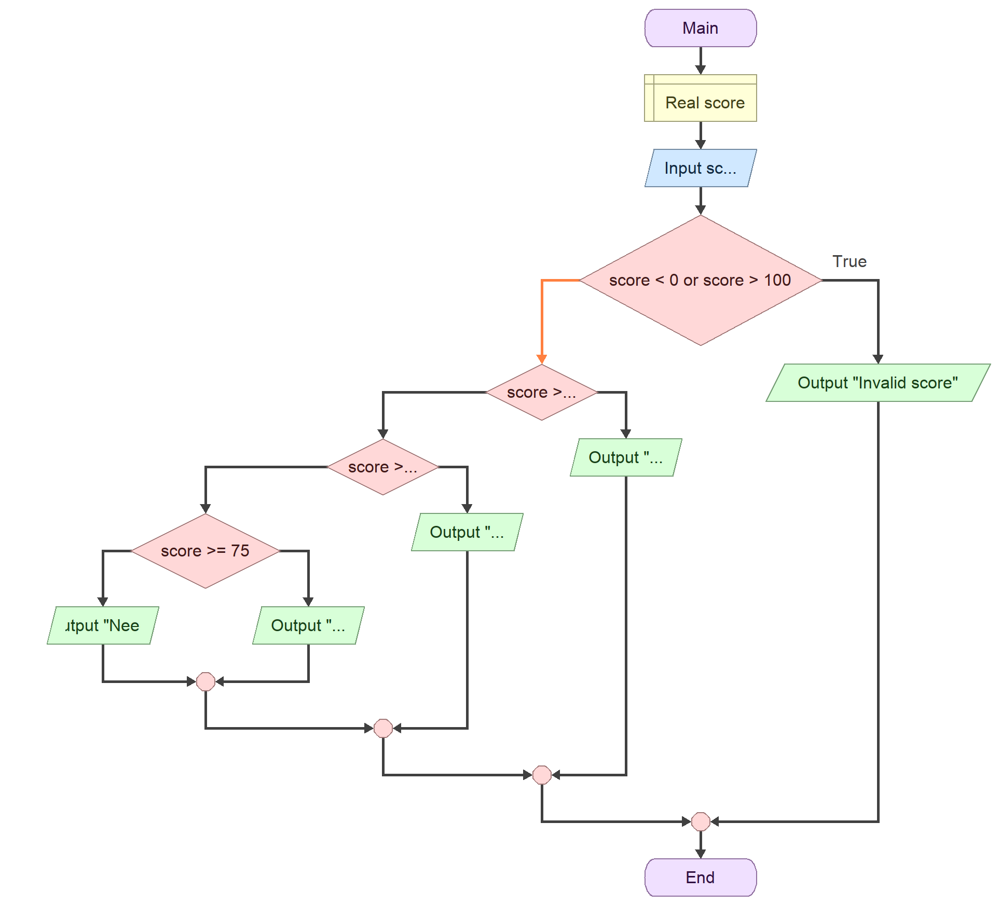

# Clean Decision Code Makeover: Student Score Checker

## Part 1 - Analyze the Logic
**Input**  
A number entered by the user, stored as a `float` to work with decimals.

**Boundary Conditions**  
Minimum Valid Score: `0`  
Maximum Valid Score: `100`

**Possible Outputs**
1. `"Invalid score"`
2. `"Outstanding"`
3. `"Very Satisfactory"`
4. `"Satisfactory"`
5. `"Needs Improvement"`

**Selection Pattern - Boundary Condition**  
The initial check `if score < 0 or score > 100:` filters out invalid scores outside the 0–100 range.

**Selection Pattern - Multiple Decision Paths**  
The `elif` / `else` chain checks valid scores step-by-step from highest to lowest to assign the right grade category.

## Flowchart


## Pseudocode
```text
Function Main
    Declare Real score

    Input score
    If score < 0 or score > 100
        Output "Invalid score"
    Else
        If score >= 90
            Output "Outstanding"
        Else
            If score >= 80
                Output "Very Satisfactory"
            Else
                If score >= 75
                    Output "Satisfactory"
                Else
                    Output "Needs Improvement"
                End
            End
        End
    End
End
```

## Testing & Validation

| Test | Input | Purpose | Expected Output | Actual Output | Result |
| :---: | :---: | :--- | :--- | :--- | :---: |
| 1 | -1 | Below minimum | Invalid score | Invalid score | Pass |
| 2 | 0 | Minimum boundary | Needs Improvement | Needs Improvement | Pass |
| 3 | 74 | Below Satisfactory boundary | Needs Improvement | Needs Improvement | Pass |
| 4 | 75 | Satisfactory boundary | Satisfactory | Satisfactory | Pass |
| 5 | 80 | Very Satisfactory boundary | Very Satisfactory | Very Satisfactory | Pass |
| 6 | 90 | Outstanding boundary | Outstanding | Outstanding | Pass |
| 7 | 100 | Maximum boundary | Outstanding | Outstanding | Pass |
| 8 | 101 | Above maximum | Invalid score | Invalid score | Pass |
